# 实作名称：Q版炸弹唐

## 组长：__________

## 课题组成员：__________

## 完成日期：2026.7

## 华南师范大学软件学院

## 2026.7

---

## 目录

1、实作项目简介............................................................................................................................... 3
2、前期准备..................................................................................................................................... 3
3、项目设计..................................................................................................................................... 4
  3.1 总体架构设计（系统结构图 / 分析类图）....................................................................... 4
  3.2 类设计（类图）................................................................................................................... 4
    3.2.1 com.bomberman.core 包........................................................................................... 4
    3.2.2 com.bomberman.model 包.......................................................................................... 5
    3.2.3 com.bomberman.view 包............................................................................................ 7
    3.2.4 com.bomberman.controller 包.................................................................................... 8
    3.2.5 com.bomberman.util 包.............................................................................................. 9
4、系统实现................................................................................................................................... 10
  4.1 界面..................................................................................................................................... 10
    4.1.1 GameCanvas 类.......................................................................................................... 10
    4.1.2 MenuView 类............................................................................................................. 12
    4.1.3 HudPanel 类.............................................................................................................. 13
  4.2 控制..................................................................................................................................... 14
    4.2.1 GameController 类.................................................................................................... 14
  4.3 资源管理.............................................................................................................................. 17
    4.3.1 ResourceLoader 类.................................................................................................... 17
5、游戏画面展示............................................................................................................................ 19
  图1. 主菜单画面........................................................................................................................ 19
  图2. 单人游戏画面.................................................................................................................... 19
  图3. 双人对战画面.................................................................................................................... 19
  图4. 爆炸效果画面.................................................................................................................... 20
  图5. 胜利结算画面.................................................................................................................... 20
6、总结......................................................................................................................................... 21
  6.1 设计亮点............................................................................................................................. 21
  6.2 不足.................................................................................................................................... 21

---

## 1. 实作项目简介

《Q版炸弹唐》是一款经典休闲游戏《泡泡堂》（Bomberman）的Java仿作，游戏类型为策略动作类。玩家在地图迷宫中放置炸弹，炸毁砖块障碍物获取道具，并利用爆炸消灭AI对手或与另一名玩家对战。游戏画面采用Q版卡通风格，操作简单，趣味性强。

游戏灵感来源于红白机经典《炸弹人》。玩家扮演可爱的Q版角色，在由墙壁和砖块构成的迷宫中，策略性地放置定时炸弹。炸弹爆炸会产生十字形火焰冲击波，摧毁砖块可能掉落道具（加速、火力提升、炸弹数量增加）。游戏支持双人对战模式，两名玩家在同一键盘上展开激烈的炸弹对决。

项目使用 Java 11 编程语言，采用 MVC 设计模式，GUI 框架使用 JavaFX 17，构建工具使用 Maven。总计约 2200 行代码，12 个核心类。

---

## 2. 前期准备

在实作之前我们进行了为期一周的初级软件实作学习，充分了解了 MVC 设计模式。在课堂上，我们紧跟老师的脚步，通过《生死救援》等射击游戏案例积累了 Java 游戏开发经验。

组员们积极交流，确立了以下分工：
- **架构设计**：分析需求，确定 MVC 三层结构，设计类图和模块接口
- **素材收集**：从网络收集泡泡堂游戏精灵图资源，包括角色头像（蓝/绿/粉/黄4色各9帧）、地图瓦片、墙壁砖块、炸弹爆炸动画、道具图标、音效BGM等
- **编码实现**：按 Model → View → Controller 顺序逐步实现，先搭建框架再填充细节
- **测试调试**：功能测试、双人联调、边界情况验证

技术选型方面，选择了 JavaFX 而非 Swing，因为 JavaFX 对 Canvas 绘图和媒体播放有更好的支持。

---

## 3. 项目设计

### 3.1 总体架构设计（系统结构图 / 分析类图）

```mermaid
flowchart LR
    subgraph V["🎮 View 视图层"]
        direction TB
        canvas["GameCanvas\n画布渲染"]
        menu["MenuView\n主菜单"]
        endView["EndView\n结算界面"]
        hud["HudPanel\n信息面板"]
    end

    subgraph C["⚙️ Controller 控制层"]
        direction TB
        gc["GameController\n核心逻辑 · 输入处理 · 游戏进程"]
        cc["CollisionController\n碰撞检测"]
        ai["AIController\nAI行为控制"]
    end

    subgraph M["📦 Model 数据层"]
        direction TB
        gm["GameModel\n游戏状态总控"]
        player["Player / AIPlayer\n玩家数据"]
        mapdata["MapData / Tile\n地图数据"]
        bomb["Bomb / Explosion\n炸弹与爆炸"]
        powerup["PowerUp\n道具数据"]
    end

    subgraph R["💾 资源层"]
        direction TB
        rl["ResourceLoader\n资源加载器（单例）\n图片缓存 · 音效管理"]
        img["图片资源\nimage/\ntiles · barriers · boom\nexplode · player · site"]
        snd["音效资源\nsounds/\nBGM · 爆炸 · 道具"]
        cfg["Config\n游戏配置常量"]
    end

    V -->|"读写"| C
    C -->|"读写"| M
    M -->|"读取"| R
    C -->|"加载资源"| R
    V -->|"读取资源"| R

    style V fill:#e3f2fd,stroke:#1565c0,color:#000
    style C fill:#fff3e0,stroke:#e65100,color:#000
    style M fill:#e8f5e9,stroke:#2e7d32,color:#000
    style R fill:#fce4ec,stroke:#c62828,color:#000
```

**数据流说明**：

| 流向 | 说明 |
|------|------|
| View → Controller | 键盘输入事件传递给控制器 |
| Controller → Model | 控制器更新玩家位置、炸弹状态、游戏进程 |
| Model → View | 视图读取 Model 数据渲染画面 |
| Model → 资源层 | 地图主题索引 → ResourceLoader 获取对应图片 |
| Controller → 资源层 | 触发音效播放（炸弹/爆炸/道具/BGM） |

View 不直接修改 Model，Controller 不直接操作 View，三者通过数据绑定和事件回调解耦。

### 3.2 类设计（类图）

#### 3.2.1 com.bomberman.core 包

核心基础设施层，提供游戏循环和场景管理。

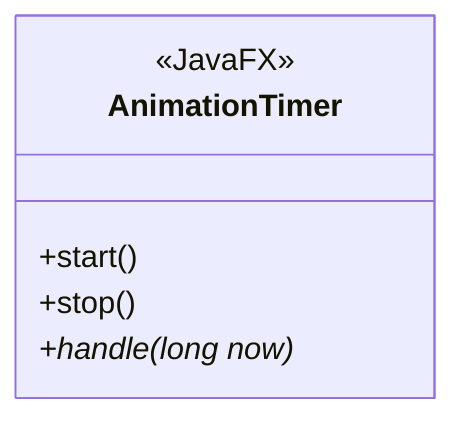

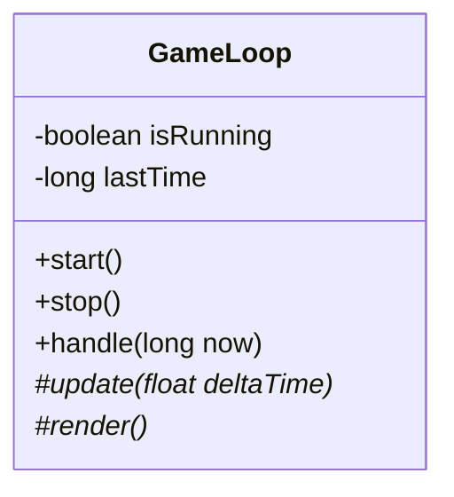

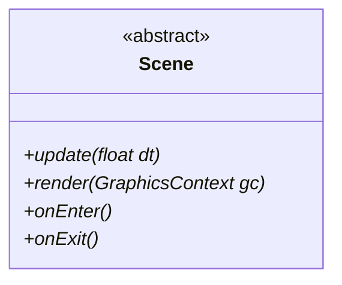

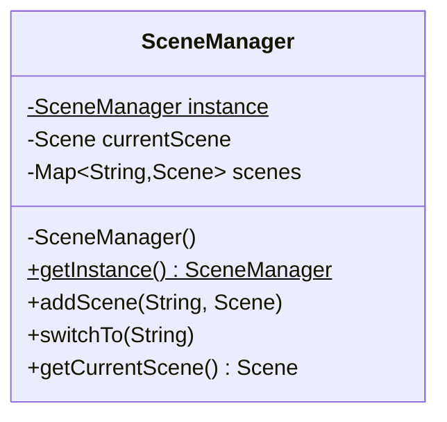

#### 3.2.2 com.bomberman.model 包

数据模型层，存储所有游戏状态，不依赖 View 和 Controller。

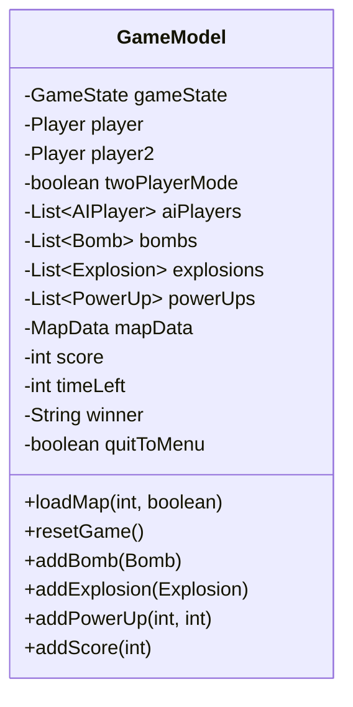

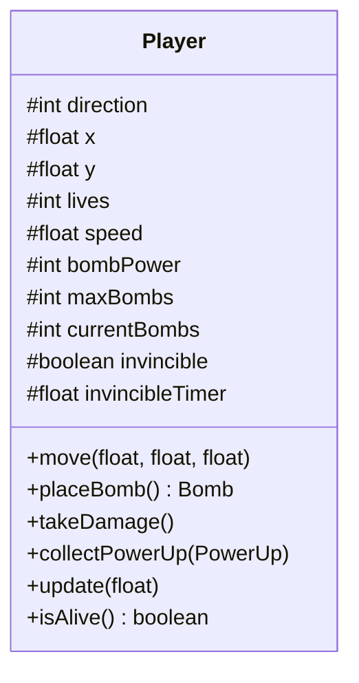

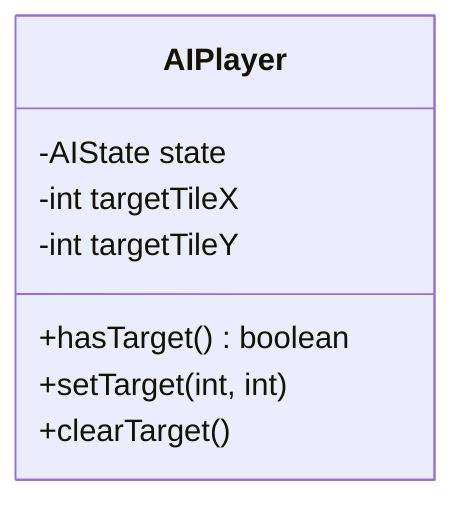

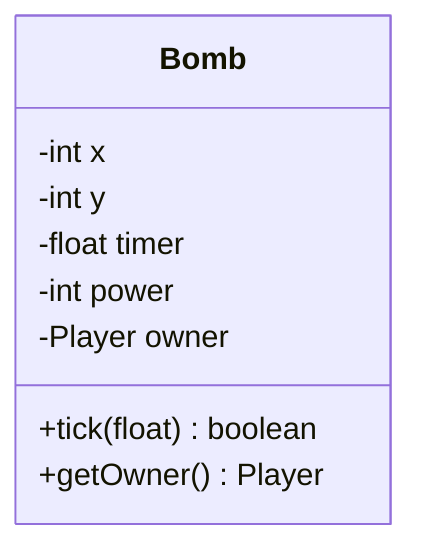

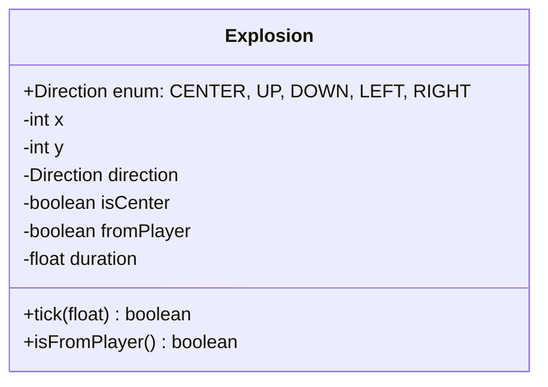

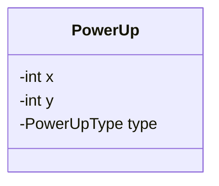

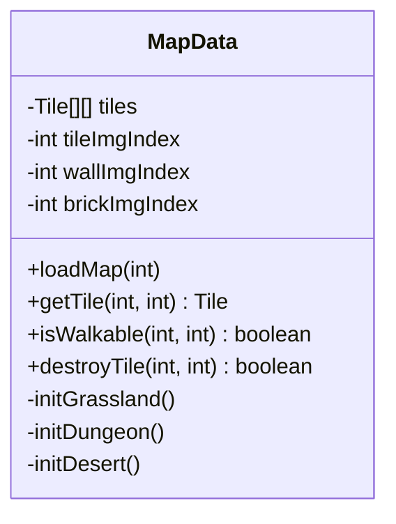

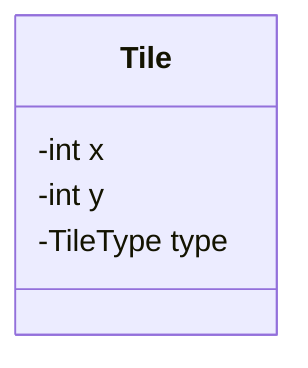

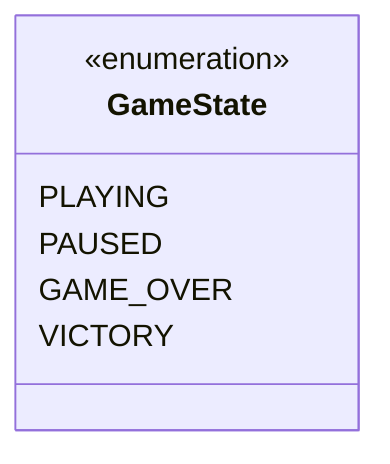

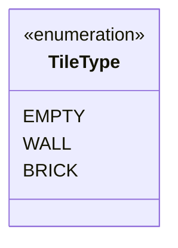

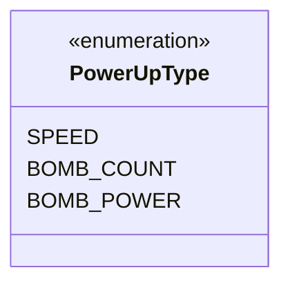

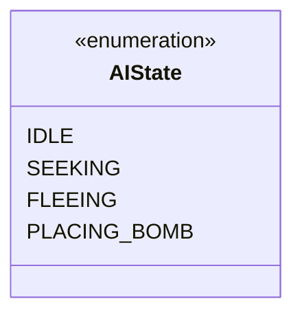

#### 3.2.3 com.bomberman.view 包

视图层，负责所有画面渲染和UI显示。

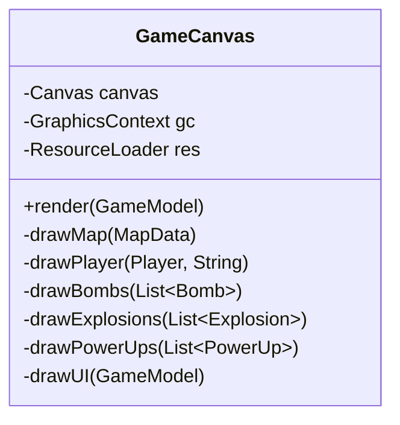

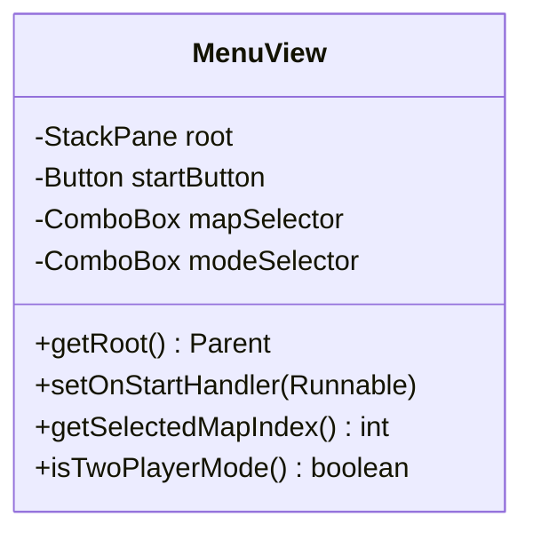

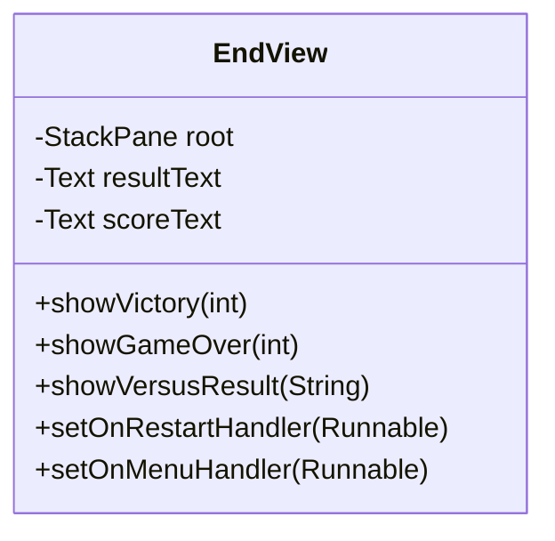

```mermaid
classDiagram
    class HudPanel {
        -VBox root
        -Label livesVal
        -Label lives2Val
        -Label scoreVal
        -Label timeVal
        -Label bombsVal
        -Label powerVal
        -VBox p2Section
        -Timeline refreshTimer
        +bind(GameModel, String)
        +unbind()
        -refresh()
    }
```

#### 3.2.4 com.bomberman.controller 包

控制层，处理输入、更新逻辑、碰撞检测。

```mermaid
classDiagram
    class GameController {
        -GameModel model
        -CollisionController collisionCtrl
        -AIController aiCtrl
        -float timeAccumulator
        -boolean spaceWasPressed
        -boolean zeroWasPressed
        -boolean pWasPressed
        +initGame(int, boolean)
        +update(float)
        -handlePauseToggle()
        -handleInput()
        -updatePlayerMovement(float)
        -updatePlayer2Movement(float)
        -movePlayer(Player, float, float, float)
        -placePlayerBomb(Player)
        -updateAI(float)
        -updateBombs(float)
        -explodeBomb(Bomb)
        -updateExplosions(float)
        -checkCollisions()
        -checkPlayerCollision(Player)
        -updateTimer(float)
        -checkWinCondition()
    }
```

```mermaid
classDiagram
    class CollisionController {
        +checkPlayerMapCollision(Player, float, float, MapData) boolean
        +checkPlayerBombCollision(Player, float, float, List~Bomb~) boolean
        +checkPlayerExplosionCollision(Player, List~Explosion~) boolean
        +checkPlayerPowerUpCollision(Player, List~PowerUp~) PowerUp
        +getBombExplosionRange(Bomb, MapData) List~Point~
    }
```

```mermaid
classDiagram
    class AIController {
        +updateAI(AIPlayer, GameModel, CollisionController, float)
    }
```

#### 3.2.5 com.bomberman.util 包

工具类层。

```mermaid
classDiagram
    class Config {
        <<constants>>
        +int TILE_SIZE = 40$
        +int MAP_WIDTH = 15$
        +int MAP_HEIGHT = 13$
        +float PLAYER_SPEED = 120.0$
        +float BOMB_TIMER = 3.0$
        +float EXPLOSION_DURATION = 0.5$
        +float INVINCIBLE_TIME = 1.0$
        +int GAME_TIME = 180$
        +int INITIAL_LIVES = 3$
        +int INITIAL_BOMBS = 1$
        +int INITIAL_POWER = 2$
    }
```

```mermaid
classDiagram
    class ResourceLoader {
        -ResourceLoader instance$
        -Map~String,Image~ imageCache
        -List~Image~ tileImages
        -List~Image~ wallImages
        -List~Image~ brickImages
        -List~Image~ bombFrames
        -Map~String,List~Image~~ explosionFrames
        -Map~String,List~Image~~ playerSprites
        -MediaPlayer bgmPlayer
        -ResourceLoader()
        +getInstance()$ ResourceLoader
        -loadAllResources()
        +getTileImageByIndex(int) Image
        +getWallImageByIndex(int) Image
        +getBrickImageByIndex(int) Image
        +getBombFrame(float) Image
        +getExplosionFrames(String) List~Image~
        +getPlayerSprites(String) List~Image~
        +playBGM()
        +stopBGM()
        +playSound(String)
    }
```

---

## 4. 系统实现

### 4.1 界面

#### 4.1.1 GameCanvas 类

游戏主画面渲染器，负责将所有 Model 数据绘制到 Canvas 上。

```java
package com.bomberman.view;

import com.bomberman.model.*;
import com.bomberman.util.Config;
import com.bomberman.util.ResourceLoader;
import javafx.scene.canvas.Canvas;
import javafx.scene.canvas.GraphicsContext;
import javafx.scene.image.Image;

public class GameCanvas {
    private final Canvas canvas;
    private final GraphicsContext gc;
    private final ResourceLoader res = ResourceLoader.getInstance();

    public void render(GameModel model) {
        // 1. 纯色背景
        gc.setFill(Color.web("#2d5a27"));
        gc.fillRect(0, 0, Config.CANVAS_WIDTH, Config.CANVAS_HEIGHT);

        // 2. 地图（地板→墙壁→砖块三层叠加）
        drawMap(model.getMapData());

        // 3. 道具
        drawPowerUps(model.getPowerUps());

        // 4. 炸弹（含倒计时数字）
        drawBombs(model.getBombs());

        // 5. 爆炸（按方向选帧+旋转）
        drawExplosions(model.getExplosions());

        // 6. 玩家1（蓝色）
        drawPlayer(model.getPlayer(), "blue");

        // 7. 玩家2（粉色，双人时）
        if (model.isTwoPlayerMode()) {
            drawPlayer(model.getPlayer2(), "pink");
        }

        // 8. AI（绿色）
        for (AIPlayer ai : model.getAIPlayers()) {
            if (ai.isAlive()) drawPlayer(ai, "green");
        }

        // 9. 暂停遮罩
        if (model.getGameState() == GameState.PAUSED) {
            gc.setFill(Color.rgb(0, 0, 0, 0.7));
            gc.fillRect(0, 0, CANVAS_WIDTH, CANVAS_HEIGHT);
            gc.fillText("暂停", CANVAS_WIDTH / 2 - 36, CANVAS_HEIGHT / 2);
        }
    }
}
```

地图绘制采用三层叠加：先铺统一地板瓦片，再盖墙壁，最后盖砖块。

```java
private void drawMap(MapData mapData) {
    Image tileImg  = res.getTileImageByIndex(mapData.getTileImgIndex());
    Image wallImg  = res.getWallImageByIndex(mapData.getWallImgIndex());
    Image brickImg = res.getBrickImageByIndex(mapData.getBrickImgIndex());

    for (int y = 0; y < MAP_HEIGHT; y++) {
        for (int x = 0; x < MAP_WIDTH; x++) {
            Tile tile = mapData.getTile(x, y);
            // 先铺地板
            if (tileImg != null) gc.drawImage(tileImg, x * TILE_SIZE, y * TILE_SIZE, TILE_SIZE, TILE_SIZE);
            // 再盖墙壁/砖块
            switch (tile.getType()) {
                case WALL:  gc.drawImage(wallImg, ...); break;
                case BRICK: gc.drawImage(brickImg, ...); break;
            }
        }
    }
}
```

玩家精灵根据移动方向切换帧，左右方向使用镜像翻转：

```java
private void drawPlayer(Player player, String color) {
    // 方向→帧映射: 0=下(idx8正面), 1=左(idx1+翻转), 2=右(idx1), 3=上(idx5背面)
    int faceIdx;
    boolean flipH = false;
    switch (player.getDirection()) {
        case 3: faceIdx = 5; break;           // 上→背面
        case 1: faceIdx = 1; flipH = true; break; // 左→翻转
        case 2: faceIdx = 1; break;           // 右→正常
        default: faceIdx = 8; break;          // 下→正面
    }
    Image sprite = sprites.get(faceIdx);
    if (flipH) {
        gc.drawImage(sprite, x + imgSize, y, -imgSize, imgSize); // 水平镜像
    } else {
        gc.drawImage(sprite, x, y, imgSize, imgSize);
    }
    // 无敌时半透明闪烁
    if (player.isInvincible() && (System.currentTimeMillis() / 100) % 2 == 0) {
        gc.setGlobalAlpha(0.4f);
    }
}
```

#### 4.1.2 MenuView 类

主菜单界面，使用 JavaFX 布局构建。

```java
package com.bomberman.view;

public class MenuView {
    private final StackPane root;
    private final ComboBox<String> mapSelector;   // 地图选择
    private final ComboBox<String> modeSelector;  // 模式选择

    public MenuView() {
        root = new StackPane();
        root.setStyle("-fx-background-color: linear-gradient(to bottom, #1a1a2e, #16213e, #0f3460);");

        VBox content = new VBox(25);
        content.setStyle("-fx-background-color: rgba(77, 0, 58, 0.92); ...");

        // 标题带发光特效
        Text title = new Text("Q版炸弹唐");
        title.setFill(Color.web("#ffd700"));
        DropShadow glow = new DropShadow();
        glow.setColor(Color.web("#ff8c00"));
        glow.setRadius(20);
        title.setEffect(glow);

        // 地图选择
        mapSelector.getItems().addAll("🌿 经典草原", "🗱 石砖地牢", "🏜 沙漠遗迹");

        // 模式选择
        modeSelector.getItems().addAll("👤 单人模式", "👥 双人模式");

        // 开始按钮（渐变+悬停效果）
        Button startButton = new Button("▶ 开始游戏");
        startButton.setOnAction(e -> onStartHandler.run());
    }
}
```

#### 4.1.3 HudPanel 类

右侧信息面板，使用 Timeline 定时刷新。

```java
package com.bomberman.view;

public class HudPanel {
    private final Label livesVal, lives2Val, scoreVal, timeVal, bombsVal, powerVal, bombs2Val, power2Val;
    private final VBox p2Section;  // P2区域（双人时才显示）

    public void bind(GameModel m, String mapName) {
        this.model = m;
        p2Section.setVisible(m.isTwoPlayerMode());  // 双人模式显示P2
        refreshTimer.play();
    }

    private void refresh() {
        Player p = model.getPlayer();
        livesVal.setText(p.getLives() + " / 3");
        scoreVal.setText(String.valueOf(model.getScore()));
        // 时间≤30秒变红警告
        timeVal.setTextFill(model.getTimeLeft() <= 30 ? Color.RED : Color.GOLD);

        if (model.isTwoPlayerMode()) {
            Player p2 = model.getPlayer2();
            lives2Val.setText(p2.getLives() + " / 3");
            // P2死亡时血量变红
            if (!p2.isAlive()) lives2Val.setTextFill(Color.RED);
        }
    }
}
```

### 4.2 控制

#### 4.2.1 GameController 类

游戏主逻辑控制器，完整实现游戏循环的每一步。

```java
package com.bomberman.controller;

public class GameController {
    private final GameModel model;
    private final CollisionController collisionCtrl;

    public void update(float deltaTime) {
        // 暂停开关（必须在 early return 之前）
        handlePauseToggle();
        if (model.getGameState() != GameState.PLAYING) return;

        handleInput();                    // 处理炸弹输入
        updatePlayerMovement(deltaTime);  // P1移动(WASD)
        if (model.isTwoPlayerMode())
            updatePlayer2Movement(deltaTime); // P2移动(方向键)
        updateAI(deltaTime);             // AI决策
        updateBombs(deltaTime);          // 炸弹倒计时
        updateExplosions(deltaTime);     // 爆炸淡出
        checkCollisions();               // 碰撞检测
        updateTimer(deltaTime);          // 倒计时
        checkWinCondition();             // 胜负
    }

    // 炸弹输入处理
    private void handleInput() {
        if (Launcher.isKeyPressed(KeyCode.SPACE) && !spaceWasPressed) {
            spaceWasPressed = true;
            placePlayerBomb(model.getPlayer());  // P1: 空格放炸弹
        }
        if (model.isTwoPlayerMode() &&
            (Launcher.isKeyPressed(KeyCode.NUMPAD0) || Launcher.isKeyPressed(KeyCode.DIGIT0))) {
            placePlayerBomb(model.getPlayer2()); // P2: 数字0放炸弹
        }
    }

    // 暂停/退出处理
    private void handlePauseToggle() {
        if (Launcher.isKeyPressed(KeyCode.P)) {
            togglePause();  // P键切换暂停
        }
        if (Launcher.isKeyPressed(KeyCode.ESCAPE)) {
            if (isPaused()) quitToMenu();  // ESC暂停中→返回菜单
            else togglePause();            // ESC游戏中→暂停
        }
    }

    // 爆炸处理（链式反应）
    private void explodeBomb(Bomb bomb) {
        List<Point> range = collisionCtrl.getBombExplosionRange(bomb, mapData);
        boolean fromPlayer = bomb.getOwner() == model.getPlayer();

        for (Point p : range) {
            model.addExplosion(new Explosion(p.x, p.y, p.direction, p.direction == CENTER, fromPlayer));
            // 摧毁砖块，概率掉落道具
            if (mapData.getTile(p.x, p.y) == BRICK) {
                mapData.destroyTile(p.x, p.y);
                if (random.nextFloat() < 0.3f) model.addPowerUp(p.x, p.y);
            }
        }
        // 链式反应：火焰范围内的其他炸弹也被引爆
        triggerChainReactions(range);
    }

    // 碰撞检测（参与者复用）
    private void checkCollisions() {
        checkPlayerCollision(model.getPlayer());          // P1
        if (model.isTwoPlayerMode())
            checkPlayerCollision(model.getPlayer2());     // P2
        for (AIPlayer ai : model.getAIPlayers())          // AI
            checkPlayerCollision(ai);
    }

    // 胜负判定
    private void checkWinCondition() {
        boolean p1Alive = model.getPlayer().isAlive();
        boolean p2Alive = model.getPlayer2().isAlive();

        if (model.isTwoPlayerMode()) {
            // 双人对战：最后存活者胜
            if (!p1Alive && !p2Alive) model.setWinner("平局！");
            else if (!p1Alive)         model.setWinner("玩家2 胜利！");
            else if (!p2Alive)         model.setWinner("玩家1 胜利！");
        } else {
            // 单人模式：消灭所有AI或玩家死亡
            boolean allAIDead = model.getAIPlayers().stream().noneMatch(AI::isAlive);
            if (allAIDead && p1Alive) endGame(VICTORY);
            if (!p1Alive) endGame(GAME_OVER);
        }
    }
}
```

碰撞检测采用包围盒（Bounding Box）方法，玩家使用5px内缩矩形与地图格子进行相交检测：

```java
public boolean checkPlayerMapCollision(Player player, float dx, float dy, MapData mapData) {
    float newX = player.getX() + dx;
    float newY = player.getY() + dy;
    // 5px内缩包围盒，避免贴墙时误判碰撞
    float left   = newX + 5;
    float right  = newX + Config.TILE_SIZE - 5;
    float top    = newY + 5;
    float bottom = newY + Config.TILE_SIZE - 5;

    int tileLeft   = (int)(left / Config.TILE_SIZE);
    int tileRight  = (int)(right / Config.TILE_SIZE);
    int tileTop    = (int)(top / Config.TILE_SIZE);
    int tileBottom = (int)(bottom / Config.TILE_SIZE);

    for (int ty = tileTop; ty <= tileBottom; ty++) {
        for (int tx = tileLeft; tx <= tileRight; tx++) {
            Tile tile = mapData.getTile(tx, ty);
            if (tile == null) continue;
            if (tile.getType() == TileType.WALL) return true;   // 墙壁阻挡
            if (tile.getType() == TileType.BRICK) return true;  // 砖块阻挡
        }
    }
    return false;
}
```

炸弹爆炸时，火焰向四个方向传播，遇到墙壁停止，遇到砖块停止但可摧毁：

```java
public List<Point> getBombExplosionRange(Bomb bomb, MapData mapData) {
    int bx = bomb.getX(), by = bomb.getY(), power = bomb.getPower();
    int[][] dirs = {{0,-1}, {0,1}, {-1,0}, {1,0}}; // 上、下、左、右

    for (int i = 0; i < 4; i++) {
        for (int d = 1; d <= power; d++) {
            int tx = bx + dirs[i][0] * d;
            int ty = by + dirs[i][1] * d;
            Tile tile = mapData.getTile(tx, ty);
            if (tile == null || tile.getType() == WALL) break;      // 墙：停止传播
            range.add(new Point(tx, ty, expDirs[i]));
            if (tile.getType() == BRICK) break;                     // 砖块：传播到此为止
        }
    }
    return range;
}
```

### 4.3 资源管理

#### 4.3.1 ResourceLoader 类

采用单例模式+预加载缓存策略管理所有游戏资源。

```java
package com.bomberman.util;

public class ResourceLoader {
    private static ResourceLoader instance;
    private final Map<String, Image> imageCache = new HashMap<>();

    // 分类存储的精灵图列表
    private final List<Image> tileImages = new ArrayList<>();          // 地板瓦片（10张）
    private final List<Image> wallImages = new ArrayList<>();          // 墙壁图片（4张）
    private final List<Image> brickImages = new ArrayList<>();         // 砖块图片（44张）
    private final List<Image> bombFrames = new ArrayList<>();          // 炸弹动画帧（22帧）
    private final Map<String, List<Image>> explosionFrames;            // 爆炸动画（4色×3帧）
    private final Map<String, List<Image>> playerSprites;              // 玩家精灵（4色×9帧）
    private final List<Image> siteImages = new ArrayList<>();          // 道具图标

    // 音效资源
    private MediaPlayer bgmPlayer;

    private ResourceLoader() { loadAllResources(); }

    private void loadAllResources() {
        loadTileImages();          // image/tiles/212-230.png
        loadWallImages();          // image/barriers/92-98.png
        loadBrickImages();         // image/barriers/100-184.png
        loadBombFrames();          // image/boom/328-370.png
        loadExplosionFrames();     // image/explode/{color}/250-272.png
        loadPlayerSprites();       // image/player_{color}/4-88.png
        loadSounds();              // sounds/*.mp3
    }

    // 地图主题索引访问
    public Image getTileImageByIndex(int index) {
        return tileImages.get(index % tileImages.size());
    }

    // 炸弹动画：根据剩余时间比例选择对应帧
    public Image getBombFrame(float timerPercent) {
        int idx = (int)((1.0f - timerPercent) * (bombFrames.size() - 1));
        return bombFrames.get(Math.min(idx, bombFrames.size() - 1));
    }

    // 音效播放
    public void playSound(String type) {
        Media media = switch (type) {
            case "bomb" -> bombMedia;
            case "explode" -> explodeMedia;
            case "prop" -> propMedia;
            default -> null;
        };
        if (media != null) new MediaPlayer(media).play();
    }
}
```

**资源映射关系**：

| 游戏元素 | 资源路径 | 数量 | 说明 |
|----------|---------|------|------|
| 地板瓦片 | image/tiles/ | 10张 | 按地图主题索引选取 |
| 墙壁 | image/barriers/92-98 | 4张 | 不可破坏 |
| 砖块 | image/barriers/100-184 | 44张 | 可破坏 |
| 炸弹 | image/boom/ | 22帧 | 按时长选帧 |
| 爆炸 | image/explode/{color}/ | 4色×3帧 | 玩家=蓝色，敌人=粉色 |
| 玩家头像 | image/player_{color}/ | 4色×9帧 | 正面/侧面/背面 |
| 道具 | image/site/ | 5张 | 速度/炸弹/火力 |
| BGM | sounds/music.mp3 | 1首 | 循环播放 |
| 音效 | sounds/*.mp3 | 5个 | 爆炸/升级/失败/道具 |

---

## 5. 游戏画面展示

### 图1. 主菜单画面
（含地图选择、单人/双人模式切换、发光标题）

### 图2. 单人游戏画面
（蓝色玩家 vs 绿色AI，右侧属性面板实时刷新）

### 图3. 双人对战画面
（蓝色P1 vs 粉色P2，双方属性独立显示）

### 图4. 爆炸效果画面
（十字形冲击波，蓝色=玩家炸弹，粉色=敌人炸弹，方向旋转正确）

### 图5. 胜利结算画面
（单人：消灭所有AI胜利；双人：最后存活者胜，平局判定）

---

## 6. 总结

### 6.1 设计亮点

**6.1.1 三层叠加地图绘制**
地图渲染采用地板→墙壁→砖块三层叠加。每个格子先铺统一的地板瓦片，再覆盖墙壁或砖块，确保视觉上无空洞。每张地图使用固定主题的瓦片/墙壁/砖块图片索引，风格统一不杂乱。

**6.1.2 基于方向的精灵动画系统**
9帧玩家精灵按方向映射：正面(第9帧)、背面(第6帧)、侧面(第2帧)。左右方向共享同一侧面帧，通过 `drawImage(img, x+w, y, -w, h)` 实现水平镜像翻转，无需额外素材。

**6.1.3 暂停/退出分离的键位设计**
P键专管暂停切换，ESC键在游戏中暂停、在暂停中返回主菜单。暂停检测在早期返回（early return）之前执行，确保暂停状态下仍能响应按键。

**6.1.4 碰撞检测中的玩家复用**
通过将碰撞检测抽象为 `checkPlayerCollision(Player)` 方法，单人模式传入P1，双人模式额外传入P2，AI循环传入每个AI。所有参与者共享同一套碰撞逻辑，避免代码重复。

**6.1.5 爆炸链式反应**
炸弹爆炸时检测火焰范围内的其他炸弹，触发链式引爆。实现方式为在爆炸处理中递归调用 `explodeBomb()`，支持多重连锁爆炸。

### 6.2 不足

**6.2.1 AI智能程度有限**
当前AI使用简单的贪心策略+随机移动，偶尔会走入自己的炸弹范围。后续可引入A*寻路算法和更完善的危险评估机制。

**6.2.2 不支持网络联机**
双人模式仅支持同一键盘对战，无法远程联机。后续可引入Socket通信实现局域网对战。

**6.2.3 地图数量有限**
仅有3张硬编码地图，无法自定义。后续可实现从配置文件加载地图，甚至加入地图编辑器。

**6.2.4 缺少更多道具类型**
当前仅有加速、炸弹+1、火力+1三种道具。经典炸弹人中的踢炸弹、遥控炸弹、穿墙等道具尚未实现。

---

> **组长**：__________　　　　**日期**：2026年7月12日
